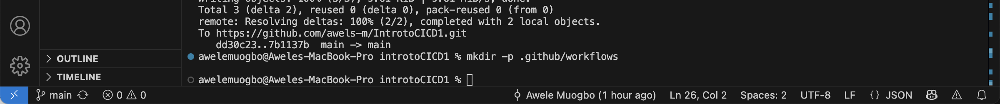
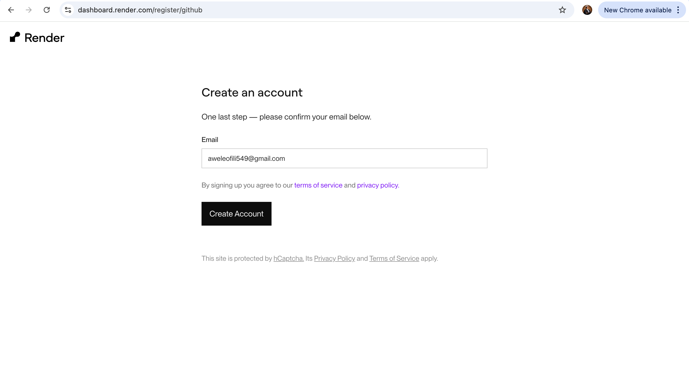
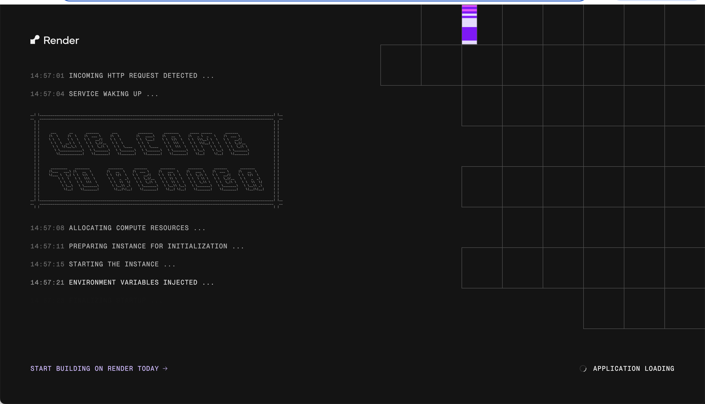

# Introtocicd
here i will be submitting my project on CI and CD

 IntroductiontoCI-CD
here i will be submitting my project on the subject

## Pre-requisites'

1. Basic Knowledge of Git and GitHub

. Understanding of version control concepts.

. Familiarity with Git operations such as clone, commit, push, and pull.

. A GitHub account and basic knowledge of repository management.

2. Understanding of Basic Programming Concepts

. Foundational programming knowledge, preferably in JavaScript (since the example project uses Node.js).

. Basic understanding of how web applications function.

3. Familiarity with Node.js and npm

. Basic knowledge of Node.js and npm (Node Package Manager).

. Ability to set up a simple Node.js project and install dependencies using npm.

4. Text Editor or IDE

. A text editor or Integrated Development Environment (IDE) such as Visual Studio Code, Atom, or Sublime Text, or any other preferred editor for writing and editing code.

5. Local Development Environment

. Node.js and npm installed on your local machine.

. Access to the command line or terminal.

6. Internet Connection

. A stable internet connection to access GitHub and other online resources or documentation.

7. Basic Understanding of CI/CD Concepts (Optional but Helpful)

. General awareness of Continuous Integration (CI) and Continuous Deployment (CD) principles.

. Prior knowledge is beneficial, though these concepts will also be introduced during the course.

# Lesson 1: Understanding Continuous Integration and Continuous Deployment

### Objectives:

1. Explain what CI/CD means and highlight its advantages.
2. Gain familiarity with how a CI/CD pipeline works.

## What CI/CD Is and Why It Matters:

### Continuous Integration (CI): 
This is the practice of frequently merging developers’ working copies into a central shared branch, sometimes several times in a single day.

### Continuous Deployment (CD): 
This refers to the process of automatically and reliably pushing software updates into production after they’ve been tested.

Key Benefits: Faster delivery of features, improved developer productivity, enhanced code quality, and better customer satisfaction.

## 2. CI/CD Pipeline Overview:

### CI Pipeline: 
Covers activities such as version control, merging code, running automated tests, and building the application.

### CD Pipeline:
 Focuses on moving the application into staging or production environments, as well as handling post-deployment monitoring.

### Common Tools:
Version control systems (like Git), CI/CD platforms (such as GitHub Actions), testing frameworks, and deployment tools.

# Lesson 2: Introduction to GitHub Actions

## Objectives:

1. Understand the role of GitHub Actions.
2. Learn key terminology and concepts.

### Lesson Details:

  #### GitHub Actions:
  This is GitHub’s built-in CI/CD service that automates building, testing, and deploying your projects directly from within your repository.

Reference: Check the [GitHub Actions Documentation](https://docs.github.com/en/actions) for more details.

---

### Key Concepts and Terms

1. Workflow

  Definition: An automated process made up of one or more jobs, configured through a YAML file inside your repository.
   Example: A workflow that builds and tests a Node.js application whenever code is pushed.
    More Info: See GitHub Docs on Workflows.

2. Event

  Definition: A trigger that starts a workflow. Events can include pushes, pull requests, creating an issue, or scheduled tasks.
    Example: A `push` event could start a workflow that runs tests anytime new code is pushed to any branch.
  More Info: Explore Events that trigger workflows in the docs.

3. Job

 Definition: A group of steps that run on the same runner. Jobs can run sequentially or in parallel.
  Example: A job that runs application tests.
  More Info: GitHub Docs on Jobs.

4.  Step

    Definition: An individual task inside a job, such as running a command or executing an action.
  Example: Running `npm install` inside a job to install dependencies.
  More Info: GitHub Docs on Steps.

5. Action

    Definition: A standalone command that can be combined with others to form steps inside a job. Actions can be created by you or used from the GitHub community.
  Example: Using `actions/checkout` to pull down your repository code.
  More Info: See the *GitHub Marketplace or the guide on Creating Actions.

6. Runner

  Definition: The server that executes your workflows. Runners can be provided by GitHub (hosted) or set up by you (self-hosted).
 Example: A GitHub-hosted runner running Ubuntu.
 More Info: GitHub Docs on Runners.

### Additional Resources:

. GitHub Learning Lab: Offers interactive lessons on GitHub Actions.
. GitHub Actions Quickstart: A hands-on guide to get started quickly.
. Community Forums: A place to connect with others, ask questions, and join discussions with the GitHub community.

 # PRATICAL PROJECT
 ## SETTING UP THE PROJECT
 1. Initialize a GitHub repository and then clone it to my local machibe,\. the images below depicts this
   
   
   
   
   
   
from the above pictures it showed 
I have created a repo named IntrotoCICD1 (the original idea was introtoCICD, but the final repo you used was IntrotoCICD1—that’s fine). In my terminal I went to my parent folder where I store projects, 
cd ~/Projects  and then i went into the project using the cd command and then used . code to be able to clone the repository and open it on my vs code. 

1. create a simple node.js application
   
   initialize a node.js project, create a simple Express.js to serve a static web page and add my code to the repository and push it to GitHub. 
  #### FIRST STEP - Prereqs (quick checks)
Open Terminal/iTerm2 and run these three commands. You should see versions printed:
node -v
npm -v
git --version

The image below depicts this

these shows that all of these are alreaqdy installed. 

the next thing i did was Initialize npm. using he command 'npm init -y'
the image below depicts this - 

the next thing i did was to install dependencies using the commands - npm install express.  Express (web server) is a production dependency. 
I also installed Dev dependencies (for tests and local dev) using the command - 
'npm install --save-dev nodemon jest supertest'
I also installed another dependency using the command - npm install --save-dev nodemon

the images below depucts this 

This creates a package.json with defaults.

This is done by using the command "npm init -y"
This creates a package.json file (your project manifest).
The -y just accepts defaults, so you don’t have to answer prompts.
Adds Express to node_modules/ and records it in package.json under dependencies.
Express is the tiny web framework we’ll use to serve your page.

Why each one?
express – minimal web framework to make the server/routes easy
nodemon – restarts the server on file changes (npm run dev)
jest – test runner
supertest – makes HTTP requests to your server during tests

   

### CREATE . .gitignore
Why it matters: without .gitignore, your node_modules would be committed to Git—huge and unnecessary.

### Create the app files

I created two files:

index.js – the entry point that starts the server

app.js – the express app (so tests can import the app without starting the server twice)

on the index.js file using vim i imputed this 
// index.js
const app = require('./app');

const port = process.env.PORT || 3000;

app.listen(port, () => {
  console.log(`App listening at http://localhost:${port}`);
});

then on the app.js, using vim i imputed this 
// app.js
const express = require('express');
const app = express();

// Home route required by the assignment
app.get('/', (req, res) => {
  res.send('Hello World!');
});

// Health route (helps CI/CD & Render check app health)
app.get('/health', (req, res) => {
  res.json({ status: 'ok' });
});

module.exports = app;

then i saved both of them and then I Added scripts to package.json. I updated scripts so I can start, dev-start, and test easily:

{
  "name": "introtocicd1",
  "version": "1.0.0",
  "main": "index.js",
  "type": "commonjs",
  "scripts": {
    "start": "node index.js",
    "dev": "nodemon index.js",
    "test": "jest --runInBand"
  },
  "dependencies": {
    "express": "^5.1.0"
  },
  "devDependencies": {
    "jest": "^29.7.0",
    "nodemon": "^3.1.10",
    "supertest": "^6.3.4"
  },
  "jest": {
    "testEnvironment": "node"
  }
}

### Common confusion I had (and fixed):

Using npm run dev is great for development (auto-reload with nodemon).
 For a normal start, use npm start. Both work after I added the scripts above

 Then on the terminal, I ran the app locally (sanity check)
npm run dev
# or
npm start

Open http://localhost:3000 and I saw “Hello World!”.

the images below depicts these

## Part Two
Add automated tests (and the first error I hit)

Create test file (mistake + fix)

I tried:
vim tests/app.test.js and when i was about to save when i saw this in Vim
"E212: Can't open file for writing"

Cause: The tests directory didn’t exist yet.
Fix:
mkdir -p tests
vim tests/app.test.js

then i went ahead to Add test content

I pasted the tests below:

// tests/app.test.js
const request = require('supertest');
const app = require('../app');

describe('GET /', () => {
  it('responds with Hello World!', async () => {
    const res = await request(app).get('/');
    expect(res.statusCode).toBe(200);
    expect(res.text).toBe('Hello World!');
  });
});

describe('GET /health', () => {
  it('returns a JSON ok payload', async () => {
    const res = await request(app).get('/health');
    expect(res.statusCode).toBe(200);
    expect(res.body).toEqual({ status: 'ok' });
  });
});

I went ahead to Run tests locally using the command 
npm test

I got 2 passing tests. Good.

then i went ahead to run the command - git branch main, git remote add origin
git push

the images below depicts this 

### Set up GitHub Actions (CI) - Create workflow file
I created the file via terminal (exact, typo-proof method):
mkdir -p .github/workflows

cat > .github/workflows/node-ci.yml << 'YAML'
name: Node CI

on:
  push:
    branches: [ "main" ]
  pull_request:
    branches: [ "main" ]

jobs:
  build-and-test:
    runs-on: ubuntu-latest

    strategy:
      matrix:
        node-version: [18.x, 20.x, 22.x]

    steps:
      - name: Checkout code
        uses: actions/checkout@v4

      - name: Use Node.js ${{ matrix.node-version }}
        uses: actions/setup-node@v4
        with:
          node-version: ${{ matrix.node-version }}
          cache: 'npm'

      - name: Install dependencies
        run: npm ci

      - name: Build (if present)
        run: npm run build --if-present

      - name: Run tests
        run: npm test
YAML

i went ahead to impute the above code on it and then, I Commited and pushed, using the commands below;
git add .
git commit -m "ci: add Node CI workflow + tests"
git push

Result: A workflow run started on GitHub automatically

1[27img](./27img.png)

## THe rest of the project
CI failed again later (test mismatch) — and how I fixed it

What happened: I customized the / route to return a different message (e.g., “Hello The Awels! CI · CD ”). That’s fine in production, but my test still expected exactly "Hello World!".

Symptom in Actions logs:

Expected: "Hello World!"
Received: "Hello The Awels! CI · CD "

Fix - I edited app.js back to:

app.get('/', (req, res) => {
  res.send('Hello World!');
});

Ran npm test locally (2 passing)

Pushed the change → GitHub Actions turned green.

1)  Final state of your project
- Folder structure
IntrotoCICD1/
├─ .github/
│  └─ workflows/
│     └─ node-ci.yml
├─ tests/
│  └─ app.test.js
├─ .gitignore
├─ app.js
├─ index.js
├─ package.json
├─ package-lock.json
└─ README.md   (optional but recommended)

### Final file contents (for auditing)

.gitignore

node_modules/
.env
coverage/

## index.js

const app = require('./app');

const port = process.env.PORT || 3000;

app.listen(port, () => {
  console.log(`App listening at http://localhost:${port}`);
});

## app.js

const express = require('express');
const app = express();

app.get('/', (req, res) => {
  res.send('Hello World!');
});

app.get('/health', (req, res) => {
  res.json({ status: 'ok' });
});

module.exports = app;

tests/app.test.js

const request = require('supertest');
const app = require('../app');

describe('GET /', () => {
  it('responds with Hello World!', async () => {
    const res = await request(app).get('/');
    expect(res.statusCode).toBe(200);
    expect(res.text).toBe('Hello World!');
  });
});

describe('GET /health', () => {
  it('returns a JSON ok payload', async () => {
    const res = await request(app).get('/health');
    expect(res.statusCode).toBe(200);
    expect(res.body).toEqual({ status: 'ok' });
  });
});

## package.json (as used for the successful run)

{
  "name": "introtocicd1",
  "version": "1.0.0",
  "description": "",
  "main": "index.js",
  "type": "commonjs",
  "scripts": {
    "start": "node index.js",
    "dev": "nodemon index.js",
    "test": "jest --runInBand"
  },
  "keywords": [],
  "author": "",
  "license": "ISC",
  "dependencies": {
    "express": "^5.1.0"
  },
  "devDependencies": {
    "jest": "^29.7.0",
    "nodemon": "^3.1.10",
    "supertest": "^6.3.4"
  },
  "jest": {
    "testEnvironment": "node"
  }
}

## .github/workflows/node-ci.yml

name: Node CI

on:
  push:
    branches: [ "main" ]
  pull_request:
    branches: [ "main" ]

jobs:
  build-and-test:
    runs-on: ubuntu-latest

    strategy:
      matrix:
        node-version: [18.x, 20.x, 22.x]

    steps:
      - name: Checkout code
        uses: actions/checkout@v4

      - name: Use Node.js ${{ matrix.node-version }}
        uses: actions/setup-node@v4
        with:
          node-version: ${{ matrix.node-version }}
          cache: 'npm'

      - name: Install dependencies
        run: npm ci

      - name: Build (if present)
        run: npm run build --if-present

      - name: Run tests
        run: npm test

##   Verification steps (how you proved it works)

Locally

npm start → open http://localhost:3000 → saw “Hello World!”

npm test → 2 passing tests

GitHub Actions (CI)

Commit & push → Actions run started

Steps succeeded: Checkout → Setup Node → Install deps → Run tests (green)

Render (CD)

Service status Live

GET / on the public URL → “Hello World!”

GET /health → { "status": "ok" }

Locally

npm start → open http://localhost:3000 → saw “Hello World!”

npm test → 2 passing tests

GitHub Actions (CI)

Commit & push → Actions run started

Steps succeeded: Checkout → Setup Node → Install deps → Run tests (green)

Render (CD)

Service status Live

GET / on the public URL → “Hello World!”

GET /health → { "status": "ok" }

### How a beginner can reproduce your entire project in ~5 minutes

Everything typed in the terminal is marked with $.

#### 1 Clone repo (or create a new local folder and npm init -y)
 git clone https://github.com/<username>/IntrotoCICD1.git
 cd IntrotoCICD1

#### 2 Create .gitignore
 printf "node_modules/\n.env\ncoverage/\n" > .gitignore

#### 3 Initialize project and install deps
 npm init -y
 npm install express
 npm install --save-dev nodemon jest supertest

#### 4 Create app files
printf "const express=require('express');const app=express();app.get('/',(req,res)=>res.send('Hello World!'));app.get('/health',(req,res)=>res.json({status:'ok'}));module.exports=app;" > app.js
 printf "const app=require('./app');const port=process.env.PORT||3000;app.listen(port,()=>console.log(\`App listening at http://localhost:\${port}\`));" > index.js

#### 5 Add scripts to package.json (edit in VS Code)
  "start": "node index.js",
 "dev": "nodemon index.js",
 "test": "jest --runInBand"
 and add  "jest": { "testEnvironment": "node" }

#### 6 Add tests
 mkdir -p tests
 cat > tests/app.test.js << 'JS'
const request = require('supertest');
const app = require('../app');
describe('GET /', () => {
  it('responds with Hello World!', async () => {
    const res = await request(app).get('/');
    expect(res.statusCode).toBe(200);
    expect(res.text).toBe('Hello World!');
  });
});
describe('GET /health', () => {
  it('returns a JSON ok payload', async () => {
    const res = await request(app).get('/health');
    expect(res.statusCode).toBe(200);
    expect(res.body).toEqual({ status: 'ok' });
  });
});
JS

#### 7 Test locally
 npm test

#### 8 Add CI workflow
mkdir -p .github/workflows
cat > .github/workflows/node-ci.yml << 'YAML'
name: Node CI
on:
  push:
    branches: [ "main" ]
  pull_request:
    branches: [ "main" ]
jobs:
  build-and-test:
    runs-on: ubuntu-latest
    strategy:
      matrix: { node-version: [18.x, 20.x, 22.x] }
    steps:
      - uses: actions/checkout@v4
      - uses: actions/setup-node@v4
        with: { node-version: ${{ matrix.node-version }}, cache: 'npm' }
      - run: npm ci
      - run: npm run build --if-present
      - run: npm test
YAML

#### Commit and push
 git add .
 git commit -m "initial CI/CD + tests"
 git push

(Render deploy is done in the Render UI as described earlier.)

### What I learned and Conclusion

How to structure a minimal Express app with a separate app.js (for tests) and index.js (for server start).

How to write basic HTTP tests using Jest + Supertest.

How GitHub Actions works: checkout, setup Node, install (npm ci vs npm install), build, test.

Why npm ci is strict and how to regenerate the lockfile when it complains.

How to deploy to Render, configure Build/Start commands, set Node version and health checks.

How tiny changes (like a different greeting) can fail CI tests and how to fix (revert the text or update the test).

How to keep production customizations while test expectations remain stable (via environment variables, optional).

the images below depicts these

